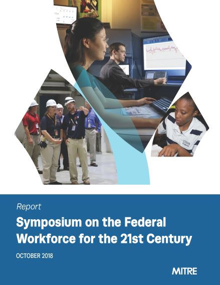

On September 12, 2018, the Office of Management and Budget (OMB), together with The MITRE Corporation, convened more than 150 experts and leaders from across the country for a full-day symposium on strategies for improving the federal workforce in support of the [President’s Management Agenda (PMA)](../PMA/pma.html) on modernizing the federal government. The objectives of the symposium were to share leading workforce development and management practices from the private and public sectors and identify next steps the federal government might take to address cross-agency people and workforce challenges. Ultimately, the goal was to energize momentum around the PMA to drive progress and fuel the government’s future workforce.

In order to drive positive change that benefits the American people, it is vital to get views from beyond the Beltway. Business leaders and human capital experts joined federal leaders to discuss leading practices in transformational change around people and the workforce in the 21st Century," said Margaret Weichert, OMB deputy director for management and acting director at the Office of Personnel Management. "The symposium was a unique opportunity to think differently about systemic HR issues that affect the President’s Management Agenda."

Participants came from all sectors, including the private and public sector, academia, and nonprofits, and represented a cross-section of functional areas such as human resources (HR), operations, information technology, and change management. OMB’s goal was to get a perspective from both “inside and outside the Beltway.” The day’s activities included presentations and panel discussions to share experiences, followed by in-depth roundtables with diverse teams of participants, to begin applying learnings to government use cases.

The collective dialog, observations, and recommendations emerging from the Federal Workforce Symposium on September 12, 2018 represent an important step forward in advancing the goals in the PMA and creating broader public-private cooperation to address federal workforce challenges. Stakeholders from across the public and private sectors shared a common understanding of the challenges and opportunities facing all organizations today, and the federal workforce specifically. While acknowledging obvious differences in their respective environments, common themes did emerge, such as the need to harness the digital transformation so that it serves government and business workforce management and the importance of people-driven strategies to successful transformation.

<a class="usa-button" href="../CAP/Symposium-Report_Federal-Workforce-FINAL-101918.pdf" target="_blank">Read the Report</a>
