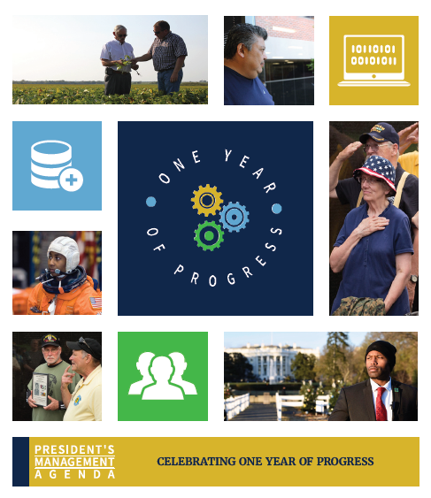

 
<em><a href="{{ site.baseurl }}/PMA/PMA-One-Year-of-Progress.pdf">Read the full update here</a></em>

One year ago in Kansas City, MO, the Administration rolled out the [President’s Management Agenda (PMA)](https://www.performance.gov/PMA/PMA.html) as a long-term vision for modernizing the Federal Government for the 21st century. Today, our [Anniversary Update]({{ site.baseurl }}/PMA/PMA-One-Year-of-Progress.pdf) highlights some of our concrete steps toward the ultimate goal of improving mission outcomes, service to the public, and stewardship of taxpayer dollars for the American people.

The PMA advances change through three drivers -- technology, data, and the workforce -- and recognizes that cross-agency collaboration is essential to finding solutions to Government’s toughest problems. From cybersecurity to small business, preschoolers to veterans, the PMA One-Year Anniversary Update highlights how agencies are succeeding and building government-wide momentum in pursuit of a modern, more effective government.

[Read about the accomplishments of the PMA so far](https://www.performance.gov/PMA/PMA.html), and stay tuned to the [@Performancegov](https://twitter.com/PerformanceGov) Twitter account and our [LinkedIn page](https://www.linkedin.com/company/35429296/admin/) as we feature the year’s progress.

*Note: The APG and CAP Goal progress updates on FY19 Q1 activities will occur in June and be combined with FY19 Q2 updates*.
