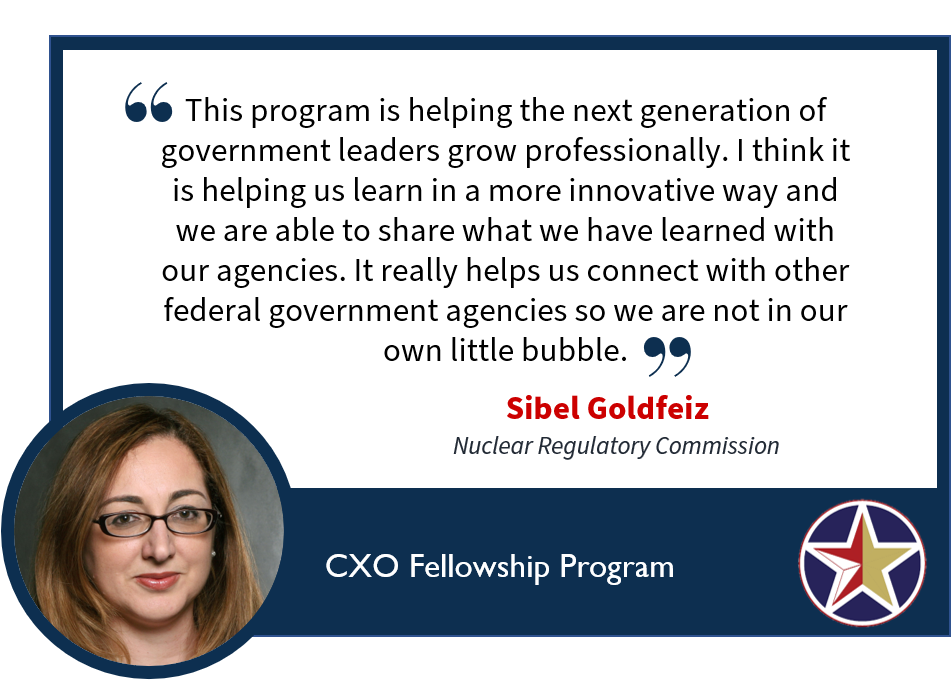
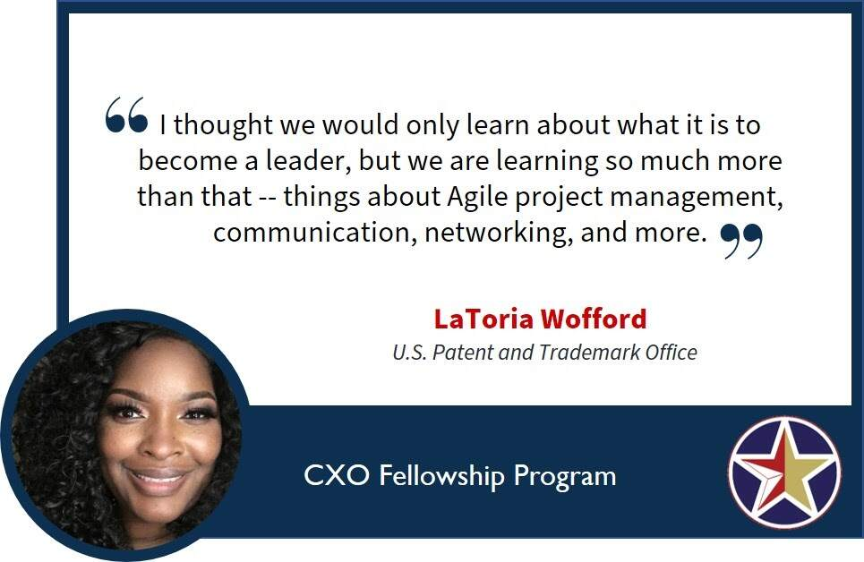
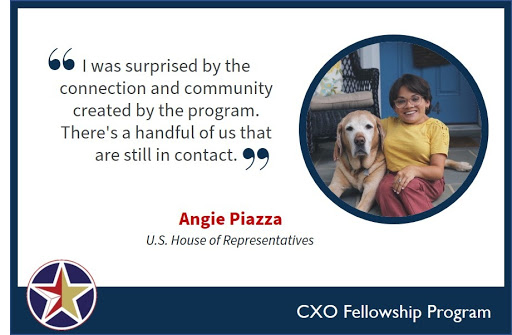
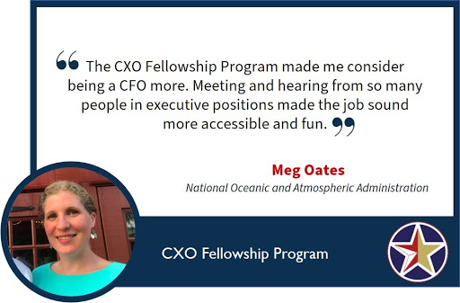
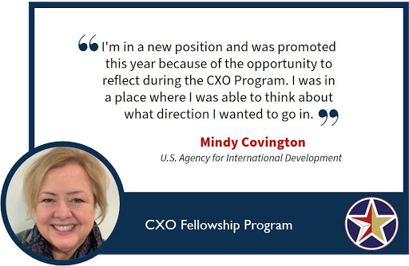
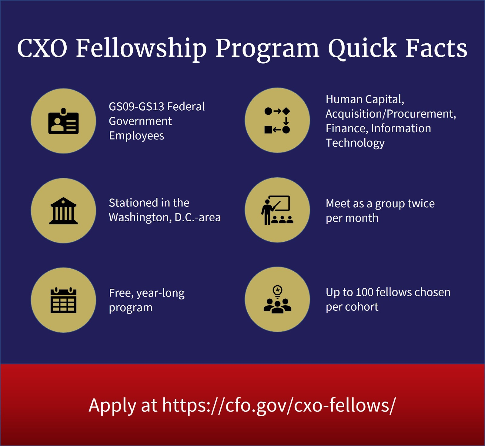

*The CXO Fellowship Program is accepting applications for the 2020-2021 cohort from May 1 through June 12, 2020. Visit the [CXO Fellowship Program page](https://cfo.gov/cxo-fellows/) to learn more and apply.*

While there are many professional development programs out there, few compare to the experiences offered through the [CXO Fellowship Program](https://cfo.gov/cxo-fellows/). To find out what the program looks like and how it impacts participants on a daily basis, we took a peek behind the curtain and saw for ourselves just how transformative this program can be.

**1. Professional Development**

  Have you been looking for a “field trip” at work? The CXO Fellowship Program takes federal employees out of their day-to-day roles and exposes them to new topics, people, and agencies. Fellows visit Washington, D.C.-area agencies to learn more about how that agency functions. While there, fellows attend sessions led by Federal Government leaders on a wide variety of topics, ranging from Agile project management to scripting an elevator pitch.

  
  

**2. Networking**

  While professional development is the main reason fellows apply for this program, we would be remiss if we didn’t highlight the incredible networking opportunity the program provides. Fellows are surrounded by 80 highly-motivated peers who want to learn new skills and take their careers to the next level. Most fellows we interviewed mentioned that the ability to learn and share best practices with their colleagues across government has had the most impact on their day-to-day job.

  

  When fellows meet, they work together to practice their new skills. Connections made in this program have led to new jobs and even new career paths. Fellows often stay in touch far past the end of the program, which shows the power of learning and connecting with their networks.

**3. Career Growth**

  Looking for a career boost? The results are in -- both current fellows and alumni agree that the CXO Fellowship Program has expanded opportunities and accelerated their careers. In addition to gaining essential leadership skills, experiencing this program with a cohort of colleagues has made a critical difference in their ability to broaden their perspectives.

  

  Fellows are exposed to leaders across government who inspire them to reflect on their path and reach higher. In the program, fellows are able to pause their routine, take a step back, and rethink the direction of their future as a federal employee.

  

---------------------------

