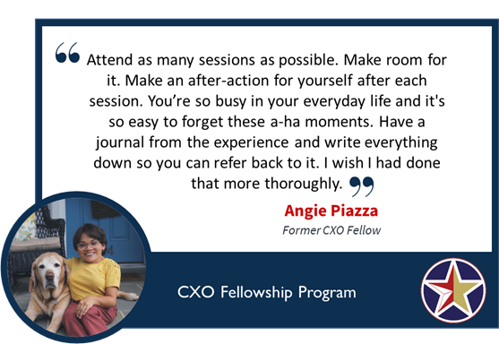
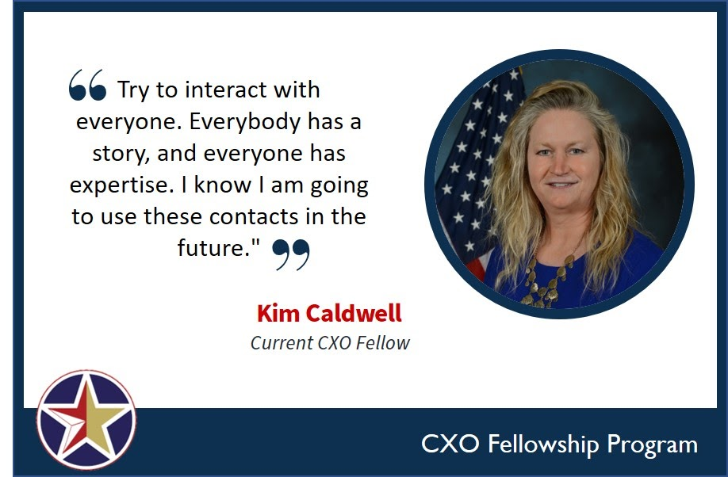
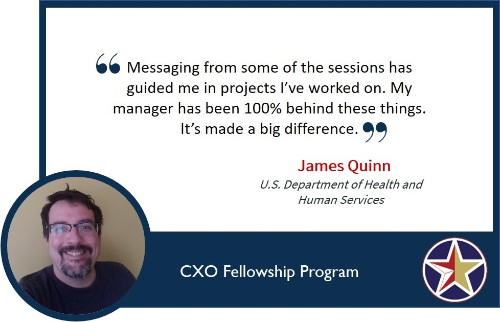
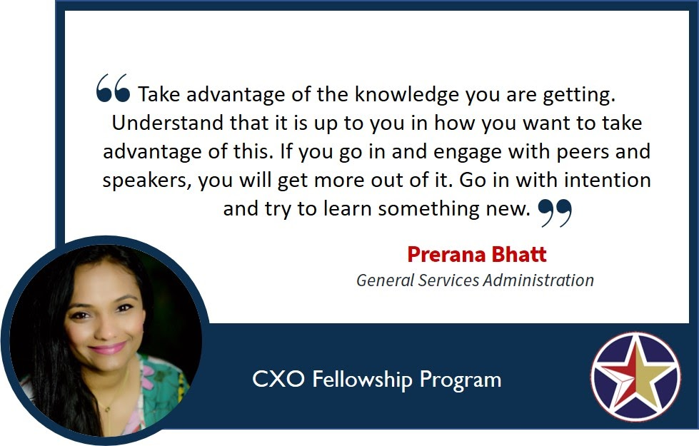

*The CXO Fellowship Program is accepting applications for the 2020-2021 cohort from May 1 through June 12, 2020. The program is open to current federal employees in the Washington, D.C. area in grades GS09-GS13. Visit the [CXO Fellowship Program page](https://cfo.gov/cxo-fellows/) to learn more and apply.*

In April, we highlighted [three reasons why you should apply to the CXO Fellowship Program](https://www.performance.gov/3-reasons-why-you-should-apply-to-CXO-fellowship-program/): professional development, networking opportunities, and career growth. If you felt that this program would be a good fit for you, check out this post full of great advice from both current fellows and program alumni.

**1. Be Present**

  Showing up and being engaged was the most common advice we heard from current and former fellows. Take advantage of the unique opportunity to pause your routine, take a step back from your day-to-day role, and reflect on your career goals. Being present will also  increase your understanding of the material as well as your ability to remember it later. Over the course of the fellowship, you’ll attend sessions on a variety of topics, ranging from agile project management to perfecting an elevator pitch. Fellows recommend having a way to capture your thoughts because some sessions may spark an idea you can take back to your agency. Even if a topic isn’t directly applicable to your current role, it may end up becoming helpful next week, next year, or in your next role.

  

**2. Network**

  The concept of “networking” is often met with resistance (and a few groans!), but recognizing the value of building and cultivating your network is often critical to success. Fellows emphasized that the opportunity to network with individuals from four different functional areas across government enabled them to exchange information and ideas with a diverse group of people.

  Many fellows told us they initially felt shy, but the program helped them break out of their shell and build confidence. Take this opportunity to find out what someone from another agency does and how their position contributes to larger federal initiatives. You may find you have more in common than you thought.

  Beyond just introducing yourself, fellows advised that you should try to get to know other fellows on a deeper level. It’s easy to have a short conversation about your job and what agency you work for, but if you ask thoughtful questions and share your interests, you may find yourself building lasting connections. Most fellows keep in touch long after the program ends, providing them with a diverse professional network they can call upon for future job opportunities or cross-agency collaboration.

**3. Practice**

  You know what they say: practice makes perfect! Fellows recommend applying what you learn in the program as early as day one. Think about how to implement new practices and ideas within your current project, team, or agency. You’ll also learn about best practices at other agencies, so be sure to bring those back to your colleagues and managers. After all, the CXO Fellowship Program not only advances your career, but also provides space for sharing ideas across the Federal Government. Agencies can learn from one another and come up with creative new solutions -- and you can help lead those efforts.

  

  The CXO Fellowship Program has the potential to make a huge impact on your career as a federal employee. Take these tips into consideration and make the most out of your time as a CXO Fellow!

  

---------------------------

**Next Steps**
- Read our last blog post, [3 Reasons Why YOU Should Apply to the CXO Fellowship Program](https://www.performance.gov/3-reasons-why-you-should-apply-to-CXO-fellowship-program/)
- Learn more and [apply to the CXO Fellowship Program](https://cfo.gov/cxo-fellows/) by June 12, 2020!

